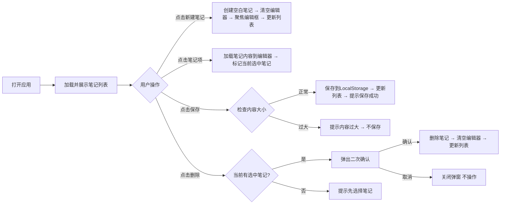

# UI设计文档

## 1. 页面结构设计

采用经典的从上到下流式布局，结构清晰，符合用户操作直觉：

```
┌─────────────────────────────────┐
│  Logo/标题 【新建笔记】按钮      │ → 顶部操作区
├─────────────────────────────────┤
│                                 │
│  笔记列表区域                    │ → 左侧/上部笔记列表（桌面端/移动端）
│  [笔记1] [笔记2] [笔记3]...      │
│                                 │
├─────────────────────────────────┤
│                                 │
│  笔记编辑区域                    │ → 核心内容区
│  [           编辑框            ]  │
│                                 │
├─────────────────────────────────┤
│  【保存】        【删除】        │ → 底部操作区
└─────────────────────────────────┘
```

**桌面端布局优化**：采用双栏布局，笔记列表在左侧固定宽度（280px），编辑区在右侧自适应宽度，更符合大屏使用习惯

---

## 2. 组件架构设计

采用原子化组件拆分，每个组件职责单一：

| 组件层级 | 组件名称 | 功能描述 |
|----------|----------|----------|
| 布局组件 | `AppContainer` | 整体页面容器，控制最大宽度和居中 |
| 布局组件 | `Header` | 顶部标题栏，放置标题和新建按钮 |
| 内容组件 | `NoteList` | 笔记列表容器 |
| 内容组件 | `NoteItem` | 单个笔记项（可点击），显示标题预览和创建时间 |
| 内容组件 | `Editor` | 笔记编辑区域 |
| 操作组件 | `NewButton` | 新建笔记按钮 |
| 操作组件 | `SaveButton` | 保存按钮 |
| 操作组件 | `DeleteButton` | 删除按钮 |
| 反馈组件 | `ConfirmDialog` | 删除二次确认弹窗 |
| 反馈组件 | `ToastMessage` | 保存成功/错误提示 |

所有组件保持极简，没有过度拆分，符合单页应用轻量定位

---

## 3. 交互流程设计

核心用户操作流程：



**交互细节优化**：
1. 笔记项添加悬浮高亮效果，让用户明确知道可以点击
2. 当前选中的笔记项添加背景标记，让用户知道当前编辑的是哪篇
3. 新建后自动聚焦到编辑框，用户可以直接输入，减少一次点击
4. 保存成功后轻量提示，不打断用户操作

---

## 4. 视觉风格建议

遵循「简洁、高效、无干扰」的笔记应用设计原则：

#### 色彩系统
- 主色：深蓝色 `#165DFF` → 专业、平静，适合笔记场景
- 背景色：浅色模式 `#F5F5F7` / 编辑器白色 `#FFFFFF`
- 文字颜色：主文本 `#333333`，次要文本 `#666666`
- 边框颜色：`#E5E5E5` → 轻薄不突兀

#### 字体系统
- 主字体：系统无衬线字体 `font-family: -apple-system, BlinkMacSystemFont, "Segoe UI", Roboto, sans-serif`
- 标题大小：24px，正文编辑：16px，列表标题：14px
- 行高：编辑区行高1.6，保证阅读舒适

#### 设计风格
- 圆角：小圆角 4px，保持现代简洁
- 阴影：轻阴影，仅用于按钮和选中状态，不厚重
- 留白：充足留白，减少视觉干扰，让用户专注内容

---

## 5. 响应式设计考虑

适配不同屏幕尺寸，保证移动端和桌面端都有良好体验：

| 断点 | 布局调整 |
|------|----------|
| > 768px (桌面端) | 双栏布局：左侧固定280px笔记列表，右侧自适应编辑区，左右分隔，操作效率更高 |
| ≤ 768px (移动端) | 单栏流式布局：笔记列表在上，编辑区在下，顺序排列，适配触摸操作，节省屏幕空间 |

#### 移动端适配细节：
1. 按钮放大到最小点击尺寸（48px高度），符合触摸操作要求
2. 编辑区默认高度占屏幕50%，保证输入区域足够
3. 取消边距缩小，充分利用移动屏幕
4. viewport设置正确，支持缩放禁止，保证体验一致

---

## 设计总结
本次设计严格遵循MVP原则，保持极简：
1. 结构清晰，操作流程符合用户直觉，学习成本为0
2. 组件拆分合理，适合原生JS开发，没有过度设计
3. 视觉简洁无干扰，突出内容本身，符合笔记产品定位
4. 完整响应式适配，移动端桌面端都能良好使用

完全满足需求文档定义的所有功能，可以直接进入开发阶段。
